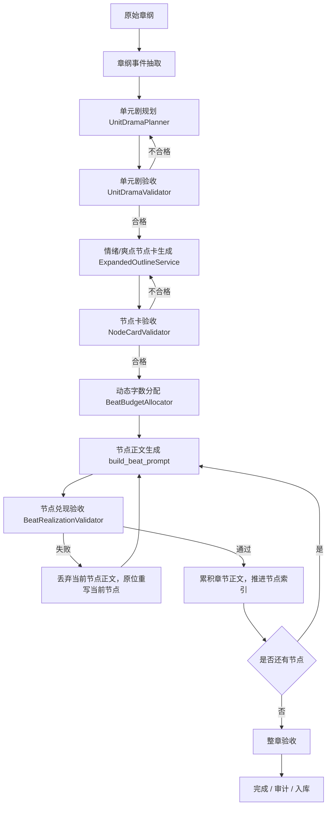

# 单元剧驱动的章纲扩写与节点生成方案

## 背景

当前自动写作链路已经具备动态节拍能力：系统会按章节目标字数、章纲复杂度、节拍最低字数、剩余预算动态拆分和整形 beat。但本轮提示词调优暴露出一个关键问题：动态的是“节点数量和字数壳”，不是“剧情节点内容”。

典型日志：

```text
节拍放大器（章纲优先）：用户大纲拆为 4 个节拍，章纲约 141 字，整章目标 2500 字
节拍功能弧扩展：原 4 拍 -> 7 拍，目标字数=2500
节拍整形：6 拍，各拍字数=[357, 357, 357, 357, 357, 715]，总目标=2500
节拍 1/6 完成: 126 字
节拍 2/6 完成: 70 字
节拍 3/6 完成: 41 字
节拍 4/6 完成: 151 字
节拍 5/6 完成: 143 字
节拍 6/6 完成: 725 字
第 1 章完成：1266 字（目标 2500 字）
```

问题不在于 `300-500` 字节点无法承载爽点。网文中一个 300-500 字节点完全可以写出代入感、小爽点和信息差。真正的问题是：当前 beat 多数只是“功能标签 + 字数目标”，例如“阻碍升级”“收束钩子”，没有被扩写成可执行的情绪/爽点节点卡。模型会完成标签，但不会自然生成足够事件容量。

## 目标

本方案将章节生成从：

```text
原始章纲 -> 动态 beat 拆分 -> 正文生成
```

升级为：

```text
原始章纲 -> 单元剧规划 -> 情绪/爽点节点卡 -> 正文生成 -> 节点与单元剧验收
```

核心原则：

1. 字数不直接分给节点，先分给单元剧，再由单元剧拆成情绪节点。
2. 正文前解决节点空心问题，不在章尾补写。
3. 最小正文节点保持 300-700 字左右，但必须具备目标、阻碍、主动动作、反馈、信息差或钩子。
4. 长章节通过增加单元剧或场景层级扩容，而不是把单个节点写肥。
5. 失败节点原位重写，丢弃短版本，不做追加式补丁。

## 设计依据

来自学习资料的关键约束：

- 节点是比故事单元更小的结构，通常可控制在 200-500 字，节点应有事件、角色配置、环境场景，并承担调动读者情绪的作用。
- 情绪节点需要经历：触发、渴望、认同、收获。
- 钩子应提前设计并埋入故事单元，不是章尾临时加一句悬念。
- 信息差来自读者、主角、对手掌握信息不同步，并推动误判、反转和期待。
- 故事单元核心是目标、阻碍、行动、小结果、转折、达成。
- 6000-7500 字约等于 3 个常规网文章节容量，通常应能完成一个小单元剧；10000-15000 字应容纳两个小单元剧或一个大单元剧加后续牵引单元。

## 核心概念

### 单元剧

单元剧是章节容量规划的上层结构。它负责承接目标字数和爽点密度。

字段建议：

```text
unit_id
title
unit_theme
target_words
protagonist_goal
goal_reward
core_obstacle
obstacle_owner_goal
pressure_line
turning_point
payoff
cost
next_hook
expected_emotion_curve
```

### 情绪/爽点节点卡

节点卡是最小正文生成单位。它不只是 beat 描述，而是当前 300-700 字正文必须兑现的小剧情结构。

字段建议：

```text
beat_id
unit_id
title
function
target_words
emotion_gap
protagonist_goal
obstacle_or_misbelief
active_action
external_feedback
information_delta
mini_payoff_or_pressure
hook_delta
sensory_anchor
forbidden_drift
acceptance_criteria
```

关键字段解释：

- `emotion_gap`：读者此刻想看到什么被满足或缓解。
- `active_action`：主角必须做出的具体动作，避免只承受、只感觉。
- `external_feedback`：他人、环境、规则或局势产生的可见变化。
- `information_delta`：读者/主角/对手的信息状态如何变化。
- `hook_delta`：本节点如何推进当前钩子或接出下一期待。
- `forbidden_drift`：本节点最容易滑向的空转方式，例如纯氛围、连续体感、设定说明。

## 目标字数与单元剧容量

字数规划应遵循动态原则，但以网文单元剧容量作为默认标尺：

```text
常规章节容量：2000-2500 字
标准小单元剧容量：6000-7500 字
情绪节点容量：300-700 字
复杂动作/对峙节点容量：500-1000 字
```

动态规划建议：

```text
target_words <= 3500
  本章通常承载一个单元剧阶段
  生成 4-6 个情绪节点

3500 < target_words <= 8500
  本章通常承载 1 个完整小单元剧
  生成 1 个单元剧，6-10 个情绪节点

8500 < target_words <= 15000
  本章通常承载 2 个小单元剧
  每个单元剧 5-8 个情绪节点

target_words > 15000
  必须引入多单元剧或场景层级
  禁止单个单元剧或单个节点硬撑长字数
```

这不是硬编码死表。最终节点数仍应由目标字数、原始章纲事件密度、场景切换数、情绪转折数、爽点数量、信息差数量共同决定。

## 新流程



## 与当前架构的关系

当前关键模块：

- `ContextBuilder.magnify_outline_to_beats()`：负责从章纲生成 beat。
- `_expand_beats_to_functional_arc()`：章纲过粗时扩成更多功能节点。
- `_cap_and_merge_beats()`：控制拍数、最低字数和整形。
- `build_beat_prompt()`：生成单拍正文提示。
- `ChapterConductor`：按剩余预算、节拍阶段进行动态字数控制。
- `autopilot_daemon`：驱动节拍生成、断点续写、章节完成检查、审计。

新方案不是废弃这些模块，而是改变 beat 的上游来源和 prompt 内容：

```text
旧：原始章纲 -> Beat(description/focus/target_words)
新：原始章纲 -> UnitDrama -> EmotionBeatCard -> Beat
```

`Beat` 可以短期兼容现有结构，把节点卡内容注入 `description` 和 `expansion_hints`；中长期建议升级为显式 DTO。

## 新增功能清单

### 1. UnitDramaPlanner

职责：

- 根据目标字数、章纲事件密度和章节位置，判断本章内部应包含几个单元剧。
- 为每个单元剧生成目标、阻碍、情绪下行、转折、爽点、代价和钩子。
- 将目标字数分配给单元剧。

输入：

```text
novel_id
chapter_number
raw_outline
target_words
genre
chapter_phase
current_state
known_context
```

输出：

```text
List[UnitDramaPlan]
```

### 2. ExpandedOutlineService

职责：

- 将 `UnitDramaPlan` 拆成情绪/爽点节点卡。
- 保证每个节点具备事件链，而不是只具备功能标签。
- 提供正文生成所需的节点卡文本。

输出：

```text
List[EmotionBeatCard]
```

### 3. NodeCardValidator

职责：

- 在正文生成前验收节点卡。
- 防止空心节点进入正文阶段。

验收规则：

```text
每个节点必须有 active_action
每个节点必须有 external_feedback
至少 60% 节点必须有 emotion_gap
至少 40% 节点必须有 information_delta
最后节点必须有 payoff/cost 或 next_hook
禁止连续两个节点都只是氛围、设定、感受或被动承受
```

### 4. BeatBudgetAllocator

职责：

- 在单元剧层和节点层分配字数。
- 根据节点功能动态加权。

建议权重：

```text
压迫铺垫：0.8
信息差/试探：1.0
行动/对峙：1.2
爽点兑现：1.3
章尾钩子：0.8-1.0
```

约束：

```text
普通节点低于 250 字时合并
普通节点超过 900 字时拆分
复杂动作/对峙节点可放宽到 1000 字
```

### 5. BeatRealizationValidator

职责：

- 正文生成后检查当前节点是否兑现节点卡。
- 失败时触发原位重写，不追加补写。

失败条件：

```text
正文低于目标字数 60%-65%
没有主角主动动作
没有外界反馈
没有信息变化或局势变化
只有环境、设定、感受、体感描写
偏离节点卡核心事件
```

### 6. UnitDramaValidator

职责：

- 整章或单元剧完成后检查单元剧闭环。

验收规则：

```text
单元剧目标是否推进
核心阻碍是否被处理或升级
爽点是否兑现
是否产生收获/代价
是否留下新期待
```

## 现有功能改造点

### ContextBuilder

改造前：

```text
raw_outline -> segment beats -> functional arc expansion -> cap/merge
```

改造后：

```text
raw_outline -> UnitDramaPlanner -> EmotionBeatCard -> Beat
```

保留：

- 动态目标拍数计算。
- 拍数整形。
- 最低字数控制。
- 与 `ChapterConductor` 的预算协同。

调整：

- `_expand_beats_to_functional_arc()` 不再凭空扩功能标签。
- 短章纲优先保留自然事件段，避免 4 个自然事件被扩成 6-7 个碎功能拍。
- `build_beat_prompt()` 从“focus + description”升级为“节点卡正文实现提示”。

### AutoNovelGenerationWorkflow

调整：

- `build_chapter_prompt()` 接收节点卡文本。
- 字数规则从“本节拍约 X 字，能收就收”改成“本节点必须完整兑现事件链，禁止未兑现就收束”。

### AutopilotDaemon

保留：

- 节拍级幂等。
- 断点续写。
- 当前拍短产出原位重写。
- 章后审计。

调整：

- 当前节点失败时，不推进 `current_beat_index`。
- 当前节点短产出时，不累积到章节正文。
- 禁止章尾补写式修复。
- Anti-AI 审计不因单一低危句式密度触发整章结构性重写。

### Prompt Packages

需要新增或改造：

```text
unit-drama-planning
expanded-outline-node-card
node-card-validation
beat-realization-validation
unit-drama-validation
```

现有 `beat-focus-instructions` 应降级为辅助风格约束，不再承担节点结构设计职责。

## 数据结构建议

### UnitDramaPlan

```python
@dataclass
class UnitDramaPlan:
    unit_id: str
    title: str
    unit_theme: str
    target_words: int
    protagonist_goal: str
    goal_reward: str
    core_obstacle: str
    obstacle_owner_goal: str
    pressure_line: str
    turning_point: str
    payoff: str
    cost: str
    next_hook: str
    expected_emotion_curve: list[str]
```

### EmotionBeatCard

```python
@dataclass
class EmotionBeatCard:
    beat_id: str
    unit_id: str
    title: str
    function: str
    target_words: int
    emotion_gap: str
    protagonist_goal: str
    obstacle_or_misbelief: str
    active_action: str
    external_feedback: str
    information_delta: str
    mini_payoff_or_pressure: str
    hook_delta: str
    sensory_anchor: str
    forbidden_drift: str
    acceptance_criteria: list[str]
```

## 示例：云泽第一章

原始章纲：

```text
云泽被三叔公以“血饲雷兽”之名扔进化形雷兽森林。雷瘴前夕，无数雷兽潜伏，云泽经脉枯竭，沦为饵食。在狼形雷兽利爪撕裂肩胛的瞬间，云泽血脉中沉睡的先天雷骨苏醒。
```

### 2500 字规划

本章承载一个单元剧阶段：血饵死局到雷骨初醒。

节点：

```text
1. 血饵处境
   情绪缺口：读者想看云泽不是等死废物。
   主动动作：云泽停止乱挣，观察死结、雷瘴和兽群动静。
   反馈：发现雷兽没有立刻扑杀。
   钩子：这场献祭不只是喂兽。

2. 雷兽围而不杀
   情绪缺口：危险逼近，但规则反常。
   主动动作：云泽用药园经验判断兽群动作不符合捕猎逻辑。
   反馈：领头雷兽盯住他的血。
   信息差：雷兽知道血有问题，云泽还不知道。

3. 血触雷纹
   情绪缺口：读者期待废物身体出现反常。
   主动动作：云泽故意让伤口贴近雷纹树皮试探。
   反馈：雷纹树亮，雷兽退。
   小爽点：云泽第一次从猎物变成不确定因素。

4. 雷骨初醒
   情绪缺口：读者想看主角抓住生机。
   主动动作：云泽借雷兽迟疑挣出空间。
   反馈：领头雷兽低吼，像警告也像臣服。
   章尾钩子：三叔公要献祭的，可能不是废物，而是禁忌血脉。
```

### 7500 字规划

本章承载一个完整小单元剧。

```text
单元剧：血饵死局到雷骨初醒

阶段 1：被献祭，处境压迫
阶段 2：雷兽围猎，规则反常
阶段 3：云泽主动试探，血触雷纹
阶段 4：雷骨苏醒，小爽兑现
阶段 5：三叔公布局反噬或更大追杀钩子
```

### 15000 字规划

本章承载两个小单元剧。

```text
单元剧 A：血饵死局
- 被献祭
- 雷兽围猎
- 云泽试探
- 雷兽退避，小爽一

单元剧 B：雷骨初醒后的逃生/反制
- 三叔公后手出现
- 雷瘴爆发
- 云泽借雷骨破局
- 雷兽态度变化
- 更大血脉秘密钩子
```

## 失败模式与防护

| 失败模式 | 原因 | 防护 |
| --- | --- | --- |
| 节点短产出 | 节点只有功能标签，没有事件链 | 节点卡必须含主动动作和外界反馈 |
| 章尾补写导致 AI 味 | 正文后补胶水段 | 失败节点原位重写，不追加 |
| 长章灌水 | 字数直接分给节点 | 字数先分给单元剧，再拆节点 |
| 碎拍拼贴 | 短章纲被过度功能弧扩展 | 短章纲保留自然事件段 |
| 审计误伤 | 单一低危句式触发整章重写 | Anti-AI 重写闸门区分严重类别 |
| 动态字数失真 | 只动态数量，不动态节点内容 | 动态节点卡生成与动态字数绑定 |

## 实施计划

### Phase 1：兜底修复

- 短章纲不再过度扩成碎拍。
- 单节点短产出原位重写。
- Anti-AI 空 system 片段不再导致崩溃。
- 单一低危句式不触发整章结构性重写。

### Phase 2：节点卡生成

- 新增 `EmotionBeatCard` DTO。
- 新增 `ExpandedOutlineService`。
- `ContextBuilder` 优先使用节点卡生成 beat。
- `build_beat_prompt()` 改为节点卡提示。

### Phase 3：单元剧规划

- 新增 `UnitDramaPlanner`。
- 根据目标字数和章纲事件密度规划单元剧数量。
- 引入单元剧层字数分配。

### Phase 4：验收闭环

- 新增 `NodeCardValidator`。
- 新增 `BeatRealizationValidator`。
- 新增 `UnitDramaValidator`。
- 将验收结果写入日志和前端状态，便于调试。

### Phase 5：持久化与可观测性

- 将扩写后的单元剧和节点卡持久化到 draft/trace。
- 前端展示单元剧、节点卡、当前节点验收结果。
- 审计日志区分：节点卡失败、正文节点失败、整章闭环失败、Anti-AI 风险。

## 架构决策

推荐采用：

```text
单元剧驱动 + 情绪节点卡 + 原位重写兜底
```

不推荐：

```text
字数不足后追加补写
```

原因：

1. 追加补写会破坏正文连续性，形成明显胶水段。
2. AI 味通常来自结构空转，补写只会增加空转概率。
3. 当前问题是节点空心，不是模型不知道目标字数。
4. 单元剧和节点卡能在正文前暴露结构问题，修复成本更低。

## 结论

本方案的关键不是“增加字数约束”，而是把章节生成的规划单位从 beat 升级为单元剧和情绪节点卡。

最终链路：

```text
原始章纲
-> 判断本章承载几个单元剧
-> 为每个单元剧生成目标/阻碍/转折/爽点/钩子
-> 将单元剧拆成情绪/爽点节点卡
-> 给节点动态分配字数
-> 按节点卡生成正文
-> 节点失败则原位重写
-> 单元剧与整章闭环验收
```

这样可以同时解决：

- 短章纲被过度拆碎。
- 300-500 字节点写不出爽点。
- 长章节靠灌水扩容。
- 字数不足后补写导致 AI 味加重。
- Anti-AI 审计误伤后整章重写劣化。

